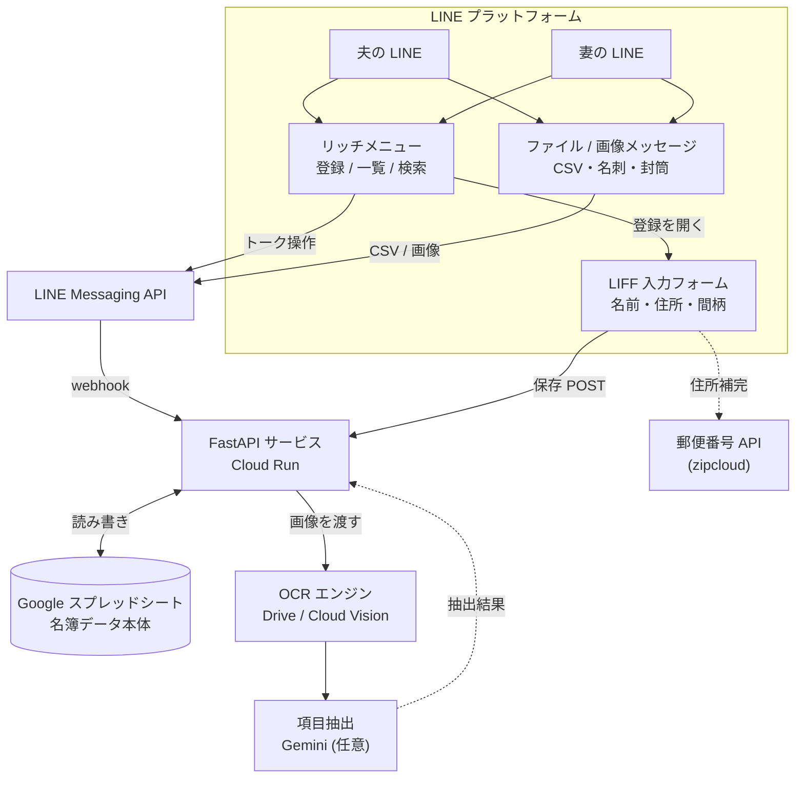
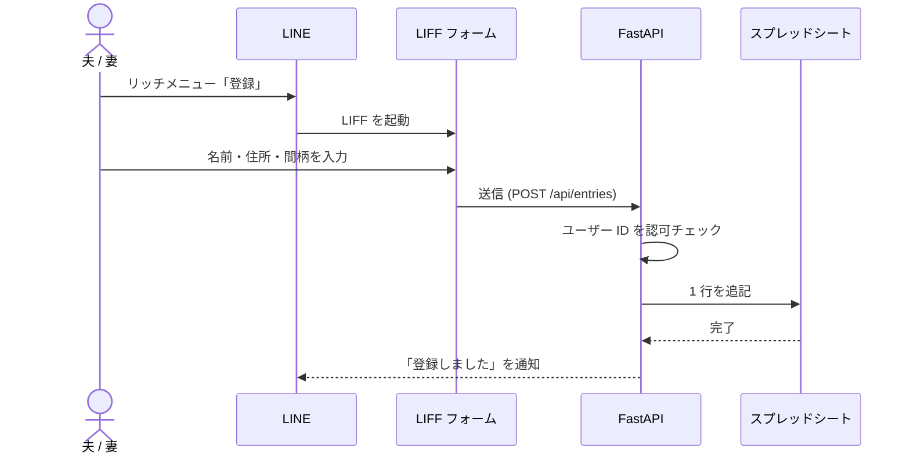
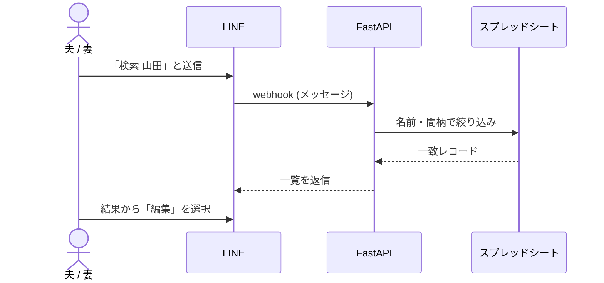
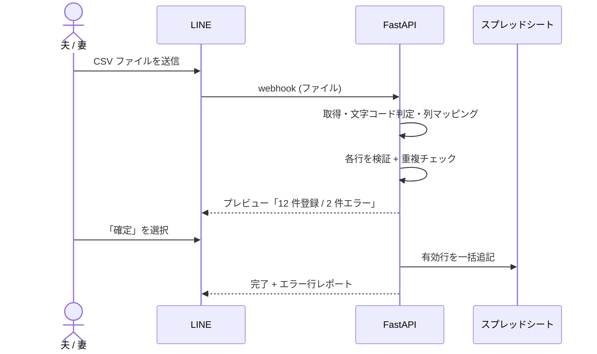
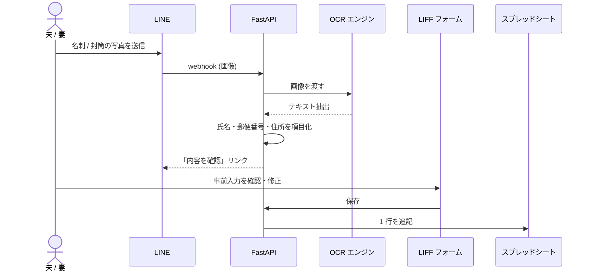

# 夫婦の名簿管理システム 設計ドキュメント (v1)

LINE をユーザー入口に、Google スプレッドシートをデータの器として使う、二人で運用する小規模な名簿管理システムの設計です。名前・住所・家族の間柄を LINE 内のフォームから登録・検索でき、CSV の一括インポートや写真からの OCR 読み取りにも対応します。

| 項目 | 内容 |
|---|---|
| 構成 | LINE × FastAPI (Cloud Run) × Google スプレッドシート |
| 入力 | LIFF フォーム / CSV / OCR |
| 利用者 | 夫婦 2 名 |
| 更新 | 2026-08-01 |

> **実装レイヤについての補足**
> 当初案では Google Apps Script (GAS) を中核に据えていましたが、本モノレポの
> 既存 LINE Bot（`fujisawa-info-bot` / `driving-license-bot` など）はすべて
> **Python + FastAPI + Cloud Run** で統一されています。保守性・パターン再利用の
> 観点から、本システムも同じスタックに合わせました。UI（LINE / LIFF）・データ層
> （Google スプレッドシート）・機能（登録 / 検索 / CSV / OCR）といった設計判断は
> すべて維持しています。

---

## 01. 概要と要件

日常的に増える親戚・知人の連絡先を、夫婦のどちらからでも **LINE から気軽に登録し、後から探せる** ことを目的とします。専用アプリのインストールや新しい操作を覚える負担をなくすため、入口は普段使いの LINE に寄せ、データは二人が直接開いて確認・修正できるスプレッドシートに置きます。

### 機能要件

- **登録** — 名前・住所・家族の間柄を LINE 内フォーム（LIFF）から入力
- **間柄は選択式** — 揺れを防ぐためプルダウンから選ぶ
- **一覧・検索** — 名前や間柄で絞り込み、LINE 上で確認
- **編集・削除** — 登録済みの内容を後から修正
- **CSV 一括インポート** — 既存の連絡先を CSV でまとめて取り込み
- **OCR 読み取り** — 名刺・年賀状・封筒などの写真から自動入力
- **二人で共有** — 夫婦どちらが登録しても同じ名簿を参照

### 非機能要件

- **低コスト** — Cloud Run / スプレッドシート / LINE の無料〜低額枠で運用
- **可視性** — スプレッドシートを直接開いて中身を確認・手修正できる
- **プライバシー** — 個人情報のため、二人以外はアクセス不可にする

---

## 02. システム構成

中核は **FastAPI サービス（Cloud Run）** です。LINE の Webhook を受け取り、Google Sheets API 経由でスプレッドシートへ読み書きします。データアクセスは Repository パターンで抽象化し、テストでは in-memory 実装に差し替えられます。

*図 1 — 全体構成。FastAPI サービスがハブとなり、フォーム・CSV・OCR の各入力経路とスプレッドシートを仲介する。*

---

## 03. コンポーネントの責務

| コンポーネント | 種別 | 責務 |
|---|---|---|
| リッチメニュー | Interface | LINE トーク下部の常設メニュー。登録 / 一覧 / 検索への入口 |
| LIFF フォーム | Input | LINE 内で開く Web フォーム。間柄プルダウン、郵便番号補完 |
| FastAPI サービス | Logic | Webhook 受信・認可・CRUD・検索・CSV・OCR・LINE 応答 |
| スプレッドシート | Storage | 名簿データ本体（1 行 = 1 人）。夫婦が直接閲覧・手修正できる |

---

## 04. データモデル

スプレッドシートの 1 行を 1 件の名簿レコードとします。**必須** は入力必須項目です。

| 列 | 項目 | 型 / 形式 | 備考 |
|---|---|---|---|
| `id` | ID | UUID | 自動採番。編集・削除の識別に使用 |
| `name` | 名前 **必須** | テキスト | フル氏名 |
| `kana` | ふりがな | テキスト | 並び替え・検索用（任意） |
| `zip` | 郵便番号 | `NNN-NNNN` | 住所自動補完のキー |
| `address` | 住所 **必須** | テキスト | 都道府県〜番地 |
| `relation` | 間柄 **必須** | 選択式 | 下記の候補から選択 |
| `note` | メモ | テキスト | 電話番号・補足など（任意） |
| `created_by` | 登録者 | 夫 / 妻 | LINE ユーザーから自動判定 |
| `created_at` | 登録日時 | ISO 8601 | 自動記録 |
| `updated_at` | 更新日時 | ISO 8601 | 自動更新 |

### 間柄（relation）の選択肢

`父` / `母` / `兄弟姉妹` / `祖父母` / `子` / `親戚` / `友人・知人` / `仕事関係` / `その他`

> **ヒント：** 選択肢は `app/models.py` の `Relation` enum で一元管理し、LIFF フォームの
> プルダウンにも API 経由で配信します。候補追加は enum を 1 箇所変更するだけで済みます。

---

## 05. 主要ユーザーフロー

### 登録フロー

*図 2 — 登録フロー。認可チェックを挟んでからスプレッドシートに書き込む。*

### 検索フロー

*図 3 — 検索フロー。結果は LINE 上に返し、そのまま編集へ繋ぐ。*

---

## 06. CSV 一括インポート

既存の連絡先や年賀状ソフトから書き出した名簿を、**まとめて取り込む** 機能です。LINE トークに CSV ファイルを送るだけで、サービスが中身を取得して検証し、確認のうえ一括登録します。書き込む前に必ずプレビューと重複チェックを挟むのが要点です。

*図 4 — CSV インポート。確定前にプレビューし、失敗行だけを差し戻す。*

### 取り込みの設計ポイント

- **列マッピング** — `name, kana, zip, address, relation, note` の見出し行を基準に対応付け。順不同でも可
- **文字コード** — Excel 由来の Shift_JIS と UTF-8 を自動判定
- **検証** — 必須項目の欠落・間柄の候補外・郵便番号形式をチェック
- **重複チェック** — 名前 ＋ 住所が一致する既存行はスキップ
- **エラーレポート** — 失敗した行番号と理由を返し、修正して再送できる

> **テンプレート配布：** 正しい列見出し入りの空 CSV を配布（またはスプレッドシートから
> 書き出し）しておくと、フォーマット崩れを未然に防げます。

---

## 07. OCR 読み取り

名刺・年賀状・封筒の宛名などを **撮影して送るだけ** で、氏名や住所を自動で読み取り、フォームに事前入力する機能です。OCR は完璧ではないため、**必ず確認・修正画面（LIFF）を挟んでから保存** する設計にします。

*図 5 — OCR 読み取り。抽出結果は確認画面で人が最終チェックしてから保存する。*

### OCR エンジンの選択肢

| エンジン | 特徴 |
|---|---|
| **Google Drive OCR** | 画像を Drive に置き Google ドキュメント変換で文字認識。追加課金なし。低頻度に十分 |
| **Cloud Vision API** | 日本語の認識精度が高い。少額課金だが無料枠あり |
| **Gemini で項目抽出（任意）** | OCR 生テキストから氏名・住所を賢く切り出す。正規表現より崩れに強い |

> **プライバシー注意：** 外部 OCR に画像を送るため、認証情報は環境側で管理し、送信対象は
> 本人の名簿用途に限定する。処理後の一時画像は残さない運用にします。

---

## 08. セキュリティと権限

名簿は個人情報の集合です。以下を最低限の防御ラインとします。

- **ユーザー ホワイトリスト** — 夫婦 2 名の LINE ユーザー ID を許可リストに登録し、それ以外の送信元は無視する
- **署名検証** — LINE からの Webhook は `X-Line-Signature`（HMAC-SHA256）を検証し、なりすましリクエストを拒否
- **シークレット管理** — チャネルアクセストークン等は環境変数（Secret Manager）で管理し、コードに直書きしない
- **共有範囲の最小化** — スプレッドシートの共有は二人のアカウント（＋サービスアカウント）のみ。公開リンクは作らない
- **LIFF エンドポイント保護** — フォーム送信時も ID トークンで本人確認し、直叩きを防ぐ

> **注意：** トークンやユーザー ID を Git に含めないこと。設定値はすべて環境変数側に置きます。

---

## 09. 実装ロードマップ

| フェーズ | 内容 | 成果物 |
|---|---|---|
| **1. 基盤づくり** | スプレッドシート（名簿シート＋設定）作成、LINE チャネル発行、FastAPI + Webhook 疎通 | 疎通する Webhook |
| **2. 登録機能（LIFF）** | LIFF フォーム（名前・住所・間柄プルダウン・郵便番号補完）と `POST /api/entries` | フォームから 1 件登録できる |
| **3. 一覧・検索・編集・削除** | リッチメニューと検索コマンド、編集・削除。二人での共有運用を確認 | 名簿の CRUD が一通り動く |
| **4. 一括入力と OCR** | CSV インポート（検証・重複・プレビュー）と OCR 読み取り＋確認フォーム。まず無料 Drive OCR で立ち上げ | まとめ取り込みと写真入力 |
| **5. 仕上げ** | バリデーション、エラーメッセージ、署名検証、使い方ガイド、CSV エクスポート | 日常運用に耐える v1 |

---

## 10. コストと将来の拡張

基本構成は Cloud Run / スプレッドシート / LINE の **無料〜低額枠** で運用できます。CSV インポートも無料の範囲です。OCR は無料の Drive OCR で始められ、精度が必要になったときだけ Cloud Vision / Gemini（いずれも無料枠あり・少額課金）へ切り替えます。

将来的に件数が大幅に増える・高速検索が必要になる場合は、**データ層だけを差し替える** 移行パスがあります。データアクセスを `RosterRepo` プロトコルに閉じ込めているため、スプレッドシート実装（`SheetsRosterRepo`）を Firestore / Cloud SQL 実装に差し替えるだけで、UI・業務ロジックは変更不要です。

| | Now（推奨） | Future |
|---|---|---|
| データ層 | Google スプレッドシート | Firestore / Cloud SQL |
| 強み | 手で開いて確認・修正できる。追加コストなし | 高速検索・大量データに強い |
| 移行 | — | `RosterRepo` 実装の差し替えのみ |
