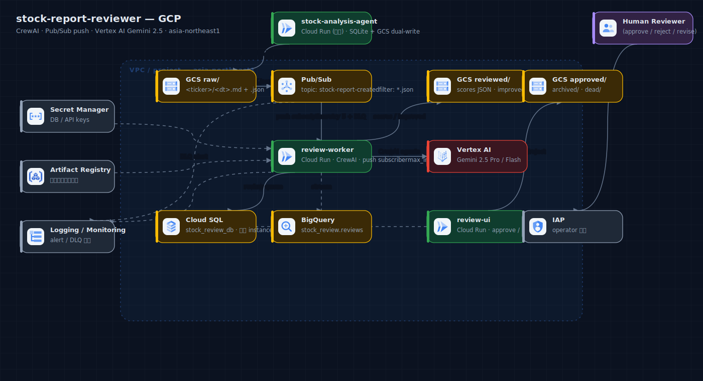

# PROPOSAL-0013: stock-analysis-agent レポート品質改善パイプライン (CrewAI + 人間レビュー)

| | |
|---|---|
| **Status** | Draft |
| **Author** | @kurama554101 |
| **Created** | 2026-06-13 |
| **Updated** | 2026-06-13 |
| **Target** | `stock-analysis-agent` (既存)、新規ディレクトリ `stock-report-reviewer/` |
| **Related PRs** | (none yet、本 PR が初版) |
| **Supersedes** | — |
| **Superseded by** | — |

---

## 1. Summary

`stock-analysis-agent` が生成する株価分析レポートに対し、**8 観点 × 5 段階スコアリング** で品質評価する **CrewAI ベースのマルチエージェント review パイプライン** を新設する。

トリガは GCS への新規レポート配置で、**Pub/Sub push subscription** で Cloud Run の review service に直接 dispatch する (Phase 1。Cloud Tasks / Pull は Phase 2 検討候補、§3.6.1 参照)。CrewAI が 6 専門 reviewer + 統括 manager + 改稿 improver の構成で並列レビュー、スコア + must_fix リストを生成する。スコアに応じて **(a) 自動 publish / (b) AI 改稿 → 人間レビュー / (c) 即人間レビュー** に分岐し、Web UI で承認ワークフローを実施する。実装は **Phase 1 (スコアリング + BQ 蓄積のみ、UI/改稿/承認なし) → Phase 2 (Web UI + 改稿 + 承認)** に分割する (§3.0)。

LLM は **Gemini 2.5 (Pro / Flash) on Vertex AI** で統一。**学習目的** のため厳密なコンプライアンスは追求せず、表現適切性 (推奨表現回避 / 断定回避 / 免責) のチェックレベルに留める。

レポート本体の永続化先として、既存の shared Cloud SQL (Postgres, `stock_analysis_db`) に加えて **GCS にも書き出す** 仕組みを stock-analysis-agent 側に追加する (review pipeline の入力源を確立)。なお PROPOSAL-0011 P2-B で primary は SQLite → Postgres に移行済み。

## 2. Motivation

### 現状の課題

`stock-analysis-agent` は Claude Opus (Vertex AI) で日本語の統合解説を生成しているが、**品質保証の仕組みがない**:

1. **数値正確性の自己検証なし**: yfinance 由来の値が解説本文と矛盾するケースを検出する仕組みがない
2. **論理的飛躍の検出なし**: 「直近上昇 → 今後も上昇」のような根拠薄弱な断定が混入しても気付かない
3. **強気/弱気バランスの検査なし**: センチメントが一方向に偏った場合の bias を機械的に検出できない
4. **トーン適切性のチェックなし**: 「買い推奨」「必勝」等の表現が混入しても警告されない (学習目的でも避けたい)
5. **品質の時系列追跡なし**: モデル更新やプロンプト改修で品質がどう変わるかの指標がない

### 放置するとどうなるか

- 個人運営の段階では問題が小さくても、ユーザ (家族 / 自分自身) が誤った数値を信じて判断する事故
- LINE / Web で配信する際、品質の低いレポートが配信されることで信頼性が低下
- モデル選定 (Opus → Sonnet 等の swap) を試みる際の客観的な品質指標がない
- 将来 paper-qa-agent 等の他エージェントに同種の review 機構を展開する際の基盤がない

### 2.1 Goals

実装は §3.0 の通り **Phase 1 (MVP) / Phase 2** に分割する。

**Phase 1 (MVP) — 品質の可視化に集中**
- [ ] **stock-analysis-agent 側にレポートの GCS 書き出し** を追加 (Postgres + GCS の dual write)
- [ ] **8 観点 × 5 段階スコア** で各レポートを自動評価し、結果を GCS + BigQuery に蓄積
- [ ] CrewAI で **6 reviewer + manager (verdict 記録)** のロール分離、Gemini on Vertex で統一
- [ ] **冪等性**: 同一レポート (hash 一致) は再 review せずスキップ
- [ ] verdict は **記録のみ** (auto-publish/分岐はせず、全件 `reviewed/` に蓄積)

**Phase 2 — 人間レビュー & 改稿**
- [ ] スコアに応じた 3 段階の workflow (auto-publish / improve+review / direct review)
- [ ] **人間レビュー UI** で pending リスト確認・スコア閲覧・approve/reject/revision 判断が完結
- [ ] **Improver (改稿)** + approve/reject ワークフロー

**共通 (非機能)**
- [ ] 1 レポート 1 サイクル ¥30〜50 程度 (Gemini Pro/Flash の cost ratio で)
- [ ] レポート受信から review 完了まで p95 5 分以内
- [ ] 月額運用コスト ¥3,500〜5,500 (200 レポート/月想定、§5.4 と一致)

### 2.2 Non-Goals

- **金融商品取引法レベルの厳密 compliance**: 学習目的の運営のため、投資勧誘表現の回避レベルで止める。本格的な金商法対応は別 proposal
- **複数レポートの横断分析**: 単一レポート品質に集中。「銘柄をまたいだ整合性」「過去レポートとの bias 一貫性」は対象外
- **人間レビュアーの SLO 管理**: 1 人運営想定で承認待ちが滞留しても OK。エンタープライズの「24h 以内承認」等は対象外
- **改稿の自動 publish**: AI improver の出力は **必ず** 人間レビューを経て publish。完全自動 publish は score >= 4.5 等の限定ケースのみ
- **本番 production としての配信品質保証**: 個人 / 家族向け学習教材レベル
- **既存 DB スキーマの変更**: primary は shared Cloud SQL (Postgres, `stock_analysis_db`、PROPOSAL-0011 P2-B 移行済) のまま。GCS は read-only の二次保存 (review pipeline の入力源)。レポート本文は P3-A で既に media バケット (1日TTL・配信用) にも出るが、review 用には無TTLの専用バケットへ dual-write する

---

## 3. Proposal

### 3.0 フェーズ分割 (MVP → Web UI)

初手で「2 サービス + Pub/Sub + 新 DB + BQ + IAP + Web UI + 8 エージェント + improver + 承認 WF」を全部入れると、学習目的の個人運営には重い。主目的「**レポート品質を可視化し、モデル/プロンプト変更の影響を客観指標で追う**」は UI/承認なしでも達成できるため、2 フェーズに分ける。

| | **Phase 1 (MVP)** | **Phase 2** |
|---|---|---|
| 目的 | 品質スコアを蓄積・可視化 | 人間レビュー & 改稿で品質を是正 |
| review-worker | ✅ 6 reviewer + manager (スコア + verdict 算出) | (同左) |
| 出力 | `reviewed/*.json` + BQ streaming insert。**verdict は記録のみ** (分岐・publish しない) | verdict で `auto_publish` / `*_human_review` に分岐 |
| Improver (改稿) | ❌ | ✅ |
| review-ui (Web UI) | ❌ | ✅ (IAP) |
| Cloud SQL `stock_review_db` | △ (reviews テーブルのみ、status は常に `reviewed`) | ✅ (review_queue + audit + 承認 status 遷移) |
| 人間承認 | ❌ | ✅ |
| 主な検証 | rubric が実レポートで機能するか / score 分布 / コスト | UI の使い勝手 / 改稿品質 / 承認運用 |

**Phase 1 のスコープで主目的の 8 割を、UI・IAP・承認 DB・improver なしで達成**できる。rubric の有効性を実データで検証し、score 分布や false positive を見てから UI に投資する。本 proposal の §3.1〜§5 は最終形 (Phase 2 込み) を記述するが、**実装 PR は Phase 1 → Phase 2 の順に分割**する。

### 3.1 User Stories

#### 3.1.1 ストーリー 1: 高品質レポートの自動公開

> stock-analysis-agent がトヨタ (7203) の分析を実行 → `gs://stock-reports/raw/7203/2026-06-13.md` に保存。
>
> 約 30 秒後、CrewAI が起動して 6 reviewer が並列実行:
>   - Fact Checker: 全数値が yfinance と一致 → 5
>   - Logic Reviewer: 結論がエビデンスから導出可 → 4
>   - Compliance: 「分析」明示、断定なし → 5
>   - Bias: 強気/弱気バランス取れ → 4
>   - Risk: 主要リスク 5 個列挙 → 5
>   - Style: 読みやすい → 5
>
> Manager 統括: 平均 4.7、must_fix なし → **auto-publish** 判定 → `gs://stock-reports/approved/7203/2026-06-13.md` にコピー。

#### 3.1.2 ストーリー 2: 改稿 + 人間レビュー

> NVDA の分析が出力された。reviewer の判定:
>   - Fact Checker: 5
>   - Logic Reviewer: 3 (「AI ブームは続く」を断定的に書いている)
>   - Compliance: 3 (「強い買い候補」表現あり)
>   - Bias: 2 (弱気要因がほぼなし)
>   - Risk: 4
>   - Style: 5
>
> Manager 統括: 平均 3.7、must_fix=2 (Logic / Compliance / Bias) → **improve + human review**。
>
> Improver が must_fix を反映して改稿 → `gs://stock-reports/improved/NVDA/2026-06-13.md`。
>
> Web UI の pending キューに表示。ユーザ (= 自分) が原文・改稿・スコア・コメントを見て承認 → `approved/` バケットへ。

#### 3.1.3 ストーリー 3: 直接人間レビュー

> 小型株 (時価総額 < ¥100B) のレポートで Fact Checker が **数値ズレ 3 件** を検出。スコア 1。
>
> Manager: factual < 3 → **AI 改稿スキップ、直接人間レビュー** (factual issue は AI に直せない可能性)。
>
> Web UI で警告色で表示、人間が yfinance を再確認して手動修正。

### 3.2 8 観点と 5 段階スコアリング rubric

各観点に対し、**reviewer agent が同じ rubric を system prompt として参照** する。スコア定義を明示することで agent 間 / 実行回 間の一貫性を高める。

#### A. 事実正確性 (Factual Accuracy)
| score | 条件 |
|---|---|
| 5 | 全数値が一次ソース (yfinance / Brave Search) と完全一致、計算ミスゼロ |
| 4 | 1〜2 件の軽微な数値ズレ (相対誤差 ≤ 1%)、本質に影響しない |
| 3 | 数件の数値ズレ、または重要指標 1 件のズレ |
| 2 | 複数の重要指標ズレ、または事実誤認 1 件 (例: 決算日付の誤り) |
| 1 | 重大な事実誤認、虚偽数値、明らかな hallucination |

#### B. 論理性・推論妥当性 (Reasoning Soundness)
| score | 条件 |
|---|---|
| 5 | 全結論がエビデンスから明確に導出、論理飛躍なし、信頼度表現も適切 |
| 4 | 大半は妥当、1 件の弱い論理ジャンプ |
| 3 | 1〜2 件の論理飛躍または根拠薄弱な主張 |
| 2 | 複数の論理飛躍、強気/弱気の片側のみ詳述 |
| 1 | 結論がエビデンスと矛盾、または根拠不在の断定 |

#### C. 完全性・カバレッジ (Completeness)
| score | 条件 |
|---|---|
| 5 | 全必須次元 (テクニカル/ファンダ/センチメント) + 主要リスク + カタリスト + 時間軸を網羅 |
| 4 | 1 つの軽微な欠落 (例: セクター比較なし) |
| 3 | 1 つの重要次元または主要リスクの欠落 |
| 2 | 複数の重要次元欠落、または時間軸/リスク双方欠落 |
| 1 | 必須要素 (テクニカル/ファンダ/センチメント) のいずれかが完全欠落 |

#### D. トーン適切性 (Tone, 学習目的版コンプライアンス)
| score | 条件 |
|---|---|
| 5 | 「分析」「情報提供」明示、断定的予測なし、免責記載あり |
| 4 | 軽微な表現問題 (「上昇しそう」等の弱い予測表現) が 1〜2 箇所 |
| 3 | 「買い」「売り」のラベル使用、または断定的予測表現が複数箇所 |
| 2 | 投資勧誘色の強い表現、確実性の誇張 (「強い買い」等) |
| 1 | 明確な投資勧誘 (「必ず上がる」「必勝」「絶対」)、誤解を招く表現 |

> **学習目的 note**: 金商法レベルの厳密判定はしない。「個人で書く投資メモとして公開しても恥ずかしくないトーン」を 4-5 の目安とする。

#### E. バイアス・公平性 (Bias / Balance)
| score | 条件 |
|---|---|
| 5 | 強気/弱気バランス良好、反対意見も適切な分量 |
| 4 | わずかな偏り (10〜20% 強気/弱気寄り) |
| 3 | 明らかな一方向偏り (30〜50%)、反対意見が手薄 |
| 2 | 著しい偏り、反対意見ほぼ無視、recency bias 顕著 |
| 1 | 完全に一方向、確証バイアス顕著、チャートパターンの都合解釈 |

#### F. リスク開示 (Risk Disclosure)
| score | 条件 |
|---|---|
| 5 | 主要リスク 5 個以上明示、分析の limitation・volatility 文脈完備 |
| 4 | 主要リスク 3〜4 個、limitations 言及あり |
| 3 | 主要リスク 1〜2 個、limitations 簡素 |
| 2 | リスク言及あるが具体性なし (「市場リスクがあります」程度) |
| 1 | リスク開示ほぼなし、または "ノーリスク" を示唆する記述 |

#### G. 可読性・形式 (Readability / Format)
| score | 条件 |
|---|---|
| 5 | 自然な日本語、構造明確、専門用語説明あり、数値形式統一 |
| 4 | ほぼ良好、軽微な不統一 1〜2 件 |
| 3 | 読めるが冗長 / 構造不明瞭、形式不統一複数 |
| 2 | 読みづらい、誤字脱字、不自然な日本語 |
| 1 | 致命的に読みづらい、論理構造崩壊 |

#### H. データ鮮度 (Currency)
| score | 条件 |
|---|---|
| 5 | 最新営業日データ、as-of 時刻明示、直近 7 日ニュース反映 |
| 4 | 1〜2 営業日古いデータ、as-of 明示 |
| 3 | 1 週間以内のデータ、as-of あいまい |
| 2 | 1 ヶ月以内のデータ、最近ニュース未反映 |
| 1 | 数ヶ月古いデータ、または鮮度情報ゼロ |

### 3.3 ロール分け (CrewAI agents)

| # | Agent | 担当観点 | Vertex モデル | tools |
|---|---|---|---|---|
| 1 | **Fact Checker** | A | gemini-2.5-flash | yfinance MCP / Brave Search / sqlglot 風の数値抽出 |
| 2 | **Logic Reviewer** | B | gemini-2.5-pro | (LLM only) |
| 3 | **Tone Reviewer** | D | gemini-2.5-pro | (LLM only、rubric を system prompt に) |
| 4 | **Bias & Balance Reviewer** | B3 + E | gemini-2.5-flash | センチメントスコア計算 helper |
| 5 | **Risk Disclosure Reviewer** | C2/C3 + F | gemini-2.5-pro | 業種別リスクテンプレート参照 |
| 6 | **Style & Readability Editor** | G + H | gemini-2.5-flash | (LLM only) |
| 7 | **Lead Manager (Synthesizer)** | 統括 | **gemini-2.5-pro** | 6 reviewer の JSON を受けて verdict 判定 |
| 8 | **Improver (改稿執筆者)** | improve | gemini-2.5-pro | 元レポート + must_fix を入力に改稿 |

### 3.4 verdict 判定ロジック (Manager)

```python
def verdict(scores: dict[str, int], must_fix: list[Issue]) -> str:
    avg = sum(scores.values()) / 8
    min_score = min(scores.values())
    has_factual_issue = scores['factual_accuracy'] <= 2
    has_compliance_issue = scores['tone'] <= 2

    if avg >= 4.5 and min_score >= 4 and len(must_fix) == 0:
        return "auto_publish"
    elif has_factual_issue or has_compliance_issue:
        return "direct_human_review"  # AI 改稿スキップ
    elif avg >= 3.5 and len(must_fix) <= 3:
        return "ai_improve_then_review"
    else:
        return "direct_human_review"
```

### 3.5 アーキテクチャ (全体)

> 📐 **GCP 構成図**: [`docs/diagrams/systems/stock-report-reviewer/gcp.png`](../diagrams/systems/stock-report-reviewer/gcp.png) — spec は [`spec.gcp.mjs`](../diagrams/systems/stock-report-reviewer/spec.gcp.mjs)
>
> 

```
[stock-analysis-agent (既存)]
   分析完了 → DB に保存 (既存: shared-pg Postgres) + GCS に dual-write (新規)
                  ├─ gs://stock-reports/raw/<ticker>/<dt>.md      (本文 Markdown、1番目)
                  └─ gs://stock-reports/raw/<ticker>/<dt>.json    (構造化データ、2番目 = trigger)
                              │
                              ▼
              [GCS Object Notification]
              Pub/Sub topic: stock-report-created
              (.md → .json の順次書込でレース回避。
               .json 以外の通知は worker 側で 200 即 ack して無視
               = アプリ内フィルタ。Pub/Sub の subscription filter は
               接尾辞一致 (.json) 非対応のため subscription では絞れない)
                              │
                              ▼
              [Pub/Sub push subscription]
              push endpoint: review-worker /internal/review
              retry: 5 回 + exponential backoff (Pub/Sub native)
              DLQ topic: stock-report-review-dlq
              → subscription で GCS dead/ にも sink
                              │
                              ▼
              [Cloud Run service: review-worker]
              POST /internal/review { gcs_uri, ticker, dt }
              max_instances=3 (Vertex AI quota の暫定保護、§7 参照)
                  │
                  ├── idempotency check (既に reviewed/ にあれば skip)
                  │
                  ▼
              CrewAI Crew (hierarchical)
                  ├── 並列実行 (6 reviewer)
                  │     ├── Fact Checker (Flash, tools)
                  │     ├── Logic Reviewer (Pro)
                  │     ├── Tone Reviewer (Pro)
                  │     ├── Bias Reviewer (Flash)
                  │     ├── Risk Reviewer (Pro)
                  │     └── Style Editor (Flash)
                  │
                  ├── Lead Manager (Pro)
                  │     ・8 score + must_fix 集約
                  │     ・verdict 判定
                  │
                  └── (verdict='ai_improve_then_review' のみ)
                      Improver (Pro)
                      ・改稿版を出力
                  │
                  ▼
              出力:
                  ├─ gs://stock-reports/reviewed/<ticker>/<dt>.json   (scores + issues)
                  ├─ gs://stock-reports/improved/<ticker>/<dt>.md     (verdict が improve の場合)
                  └─ BQ `stock_review.reviews` に streaming insert
                              │
                              ▼
              verdict 別の分岐:
                  ├─ auto_publish      → gs://stock-reports/approved/<ticker>/<dt>.md
                  └─ *_human_review    → Cloud SQL `review_queue` に enqueue
                                          → Web UI で承認待ち表示

[Cloud Run service: review-ui (Web UI、IAP 認証)]
   ├── /reviews/pending         pending リスト
   ├── /reviews/{id}            原文 + 改稿 + 8 scores + コメント
   ├── POST /reviews/{id}/approve   → approved/ にコピー
   ├── POST /reviews/{id}/reject    → archived/ に移動
   └── POST /reviews/{id}/revise    → コメント付きで AI に再委託
```

### 3.6 stock-analysis-agent への変更 (GCS 書き出し)

既存の DB 保存 (`save_report`、Postgres) は維持しつつ、`STOCK_REPORTS_GCS_BUCKET` が設定されていれば GCS にも同時書き出し (L1: レポート本文は P3-A で media バケットにも出るが TTL 1日・配信用のため、review 用には無TTLの専用バケットに別途 dual-write する):

```python
# app/services/database.py に追記
async def save_report(ticker, company_name, report_data) -> int:
    # 既存: shared Cloud SQL (Postgres) に保存 (P2-B 以降 SQLAlchemy 実装)
    report_id = await _persist_report_to_db(ticker, company_name, report_data)

    # 新規: GCS にも書き出し (env で有効化、失敗しても SQLite は成功とみなす)
    if settings.stock_reports_gcs_bucket:
        try:
            await _save_to_gcs(
                bucket=settings.stock_reports_gcs_bucket,
                ticker=ticker,
                report_id=report_id,
                report_data=report_data,
            )
        except Exception as e:
            logger.warning("GCS save failed (SQLite OK): %s", e)
    return report_id

def _save_to_gcs(bucket, ticker, report_id, report_data):
    dt = date.today().isoformat()
    # Markdown 本文 (LLM 解説部分)。本文キーは report_text (model_dump 由来)。
    storage.upload(
        f"gs://{bucket}/raw/{ticker}/{dt}_{report_id}.md",
        report_data["report_text"],
    )
    # 構造化データ (チャート URL / 指標 / メタ)
    storage.upload(
        f"gs://{bucket}/raw/{ticker}/{dt}_{report_id}.json",
        json.dumps(report_data, ensure_ascii=False),
    )
```

新規 env:
- `STOCK_REPORTS_GCS_BUCKET` — 未設定なら GCS 書き出し無効 (既存挙動)
- `STOCK_REPORTS_GCS_PREFIX` — 既定 `raw/`

> **注 (L2)**: `save_report` は **worker (`stock-analysis-worker`)** で呼ばれる (分析実行は Cloud Tasks→worker、PROPOSAL-0011 P3-A)。GCS 書込の IAM (objectAdmin) と env は **worker に** 付与する (webhook ではない)。

### 3.6.1 トリガ方式の選定 (Pub/Sub push 採用、Cloud Tasks / Pull は Phase 2 候補)

GCS への新規レポート配置を review pipeline に流す方式として、以下 3 案を検討した:

| | 案 A: GCS → Pub/Sub → Cloud Tasks | **案 B: GCS → Pub/Sub push (採用)** | 案 C: GCS → Pub/Sub pull |
|---|---|---|---|
| コンポーネント数 | 5 (enqueue-svc + Tasks 追加) | **3** | 3 |
| Subscriber 起点 | Cloud Tasks → push | Pub/Sub → push | review-worker → pull |
| Cloud Run min_instances | 0 OK | **0 OK** | **1 必須** (常時 pull) |
| 月額 (Cloud Run idle) | ¥500 | **¥0〜500** | ¥2,500 |
| ack deadline 上限 | task lifetime 30 日 | 600 秒 (10 分) | 600 秒/ack だが `modifyAckDeadline` で動的延長可 (実質 1 時間) |
| Backpressure 制御 | ◎ queue rate limit | △ Cloud Run max_instances で代用 | ◎ subscriber が自分で pull pace 制御 |
| 並列度の細かい制御 | ◎ queue 単位 | △ | ◎ subscriber コードで自由 |
| ロングテール耐性 (タスク > 10 分) | ◎ | △ (push ack timeout の懸念) | ◎ ack 延長で対応可 |
| 実装複雑度 | 中 | 低 | 中 (pull loop + ack 管理) |
| 二重通知レース対策 | `.ready` marker file | `.json` をアプリ内 filter | `.json` をアプリ内 filter |

#### 案 A: GCS → Pub/Sub → Cloud Tasks → review-worker (marker file 併用)

```
stock-analysis-agent → GCS:
   raw/<ticker>/<dt>.md
   raw/<ticker>/<dt>.json
   raw/<ticker>/<dt>.ready   ← 空 marker file (両ファイル書き完了後に書く)
        ↓
   Pub/Sub (filter: .ready のみ)
        ↓
   enqueue-svc (Pub/Sub push 受信、Cloud Tasks にコピー)
        ↓
   Cloud Tasks queue (rate limit 5 req/s、retry 3、DLQ)
        ↓
   review-worker
```

メリット: **queue 単位 rate limit** が `--max-dispatches-per-second` で明示制御可。並列度・retry policy が task 単位で柔軟。
デメリット: コンポーネント増、Pub/Sub 自身も retry/DLQ を持つため二重キューで責務重複感。

#### 案 B: GCS → Pub/Sub push subscription → review-worker (**Phase 1 採用**)

```
stock-analysis-agent → GCS:
   raw/<ticker>/<dt>.md       (1番目)
   raw/<ticker>/<dt>.json     (2番目、書き順を保証)
        ↓
   Pub/Sub (全 OBJECT_FINALIZE を push、.json 判定は worker 側)
        ↓ push subscription (OIDC 認証付き)
   review-worker /internal/review
```

メリット: **コンポーネント 2 つ削減** (enqueue-svc + Cloud Tasks queue)。Pub/Sub 自身が retry (最大 5 回 + 指数 backoff) と DLQ topic を持つので機能的に十分。Cloud Run min=0 でアイドル時コストゼロ。二重通知レースは **worker 側のアプリ内フィルタ** (.json 以外を即 ack でスキップ) で吸収 (Pub/Sub の subscription filter は接尾辞一致非対応のため、subscription では絞れない)。
デメリット: per-queue の細かい rate limit が効かせにくい (Pub/Sub subscription に dispatch rate 制御がない)。Cloud Run の `max_instances` で代用するが、これは「最大並列数」であり「秒あたり dispatch 数」ではない。

#### 案 C: GCS → Pub/Sub pull subscription → review-worker (Phase 2 候補)

```
stock-analysis-agent → GCS:
   raw/<ticker>/<dt>.md, .json
        ↓
   Pub/Sub (全 OBJECT_FINALIZE、.json 判定は worker 側)
        ↓
   review-worker (常時起動、google-cloud-pubsub の StreamingPull で消費)
   - 自分の処理スループットに応じて pull pace 制御
   - 長尺タスク中は modifyAckDeadline で ack 延長
```

メリット: **backpressure 制御がクリーン**。CrewAI が変動長 (30 秒〜10 分超) でも ack 延長で吸収。並列度を subscriber コード側で自由に制御可能。
デメリット: Cloud Run `min_instances=1` 必須 (常時 pull するため)。月額 ¥2,500 程度の上乗せ。pull loop + ack lease 管理の実装が増える。

#### 採用判断

**案 B (Pub/Sub push 直接) を Phase 1 で採用**。理由:

1. 個人運営の 200 レポート/月 (実態は allow-list + レート制限で数件/日) では Cloud Tasks の queue 単位 rate limit が必須でない
2. CrewAI 1 サイクル = 30〜90 秒なので、push の ack deadline 600 秒に余裕で収まる (99 パーセンタイル想定でも 3 分以内)
3. Cloud Run min=0 でアイドル時コストゼロ。Phase 1 のコスト目標 ¥3,500〜5,500/月 を維持するため pull の常時起動コスト ¥2,500/月 は避けたい
4. コンポーネント数を最小化することで運用・debug を簡素化

#### Phase 2 で再検討する条件

以下が観測された場合、案 A (Cloud Tasks 再導入) または 案 C (Pull 切替) を別 PR で検討する:

- **Vertex AI Gemini 429 が日次で 5% 超** → 案 A の queue rate limit が活きる
- **CrewAI 実行時間が 10 分超に頻発** (ロングテール顕在化) → 案 C の ack 延長メカニズムが必要
- **一過性のレポート集中** (例: 朝市場開始時に 50 件同時) で review が捌けない → 案 A / C どちらでも対応可、cost 比較で選定
- **per-ticker / per-user の優先度制御が要件化** → 案 A (multi-queue) が向く

判断指標は §5.1 Monitoring で計測する `llm_call.error_rate` と `review_lag` (受信から review 完了までの時間) の 2 つ。

### 3.7 Notes / Constraints / Caveats

- **`stock-analysis-agent` 本体は Claude Opus 4.6 を継続**: 既存運用への影響を避け、review 側だけ Gemini に統一
- **idempotency**: GCS object の SHA256 を review_id にし、同じ hash は再実行スキップ。Pub/Sub の at-least-once 配信 (同一メッセージが複数回 push される可能性) も同 hash check で吸収
- **二重通知レース対策**: stock-analysis-agent は `.md` → `.json` の順で書く。`.json` の通知のみを review トリガとするフィルタは **worker 側のアプリ内で実施** (.json 以外は 200 即 ack でスキップ)。Pub/Sub の subscription filter は `=` / `!=` / `hasPrefix()` のみで **接尾辞一致 (`.json`) 非対応**のため、subscription レベルでは絞れない (案 B、§3.6.1 参照)
- **冗長 review の抑制**: 同銘柄・同日に複数レポートがあっても、最新の 1 つだけ review (古い方は archived)
- **失敗時の DLQ**: Pub/Sub subscription の retry 5 回後 → DLQ topic `stock-report-review-dlq` に転送 → そこから GCS `gs://stock-reports/dead/<ticker>/<dt>.json` に sink + Slack 通知
- **Cost guard**: per-day budget (¥500/day) を超えると enqueue 停止、人手承認で再開
- **モデル選択の根拠**: Gemini 2.5 Pro は Claude Sonnet 4.6 と同等 reasoning、Flash は機械的タスクで十分。Gemini は Vertex AI native で IAM / Workload Identity が綺麗、analytics-platform との integration も既存
- **reviewer の並列実行**: `Process.hierarchical` は manager 主導の **逐次委譲** が基本。6 reviewer を真に並列化するには async kickoff / `kickoff_for_each` / 並列 task 構成を用いる。逐次 (Pro 中心) だと 1 サイクル 2〜4 分になり得るため、Phase 1 は **Flash 主体 + 並列化** で 30〜90 秒を目標にする (§5.4 性能と整合)
- **CrewAI version pin**: 最新を採用するが `uv.lock` で pin。breaking change を CI で週次検知
- **Web UI の認証**: Identity-Aware Proxy (IAP) で個人 email allowlist。家族追加時は IAP membership に追加。**Cloud Run 直接 IAP** を使い外部 HTTPS LB を不要にする (LB 方式だと月 ~¥2,500 の baseline が乗るため避ける)

### 3.8 Risks and Mitigations

| リスク | 影響度 | 対策 |
|---|---|---|
| review コスト爆発 | Medium | per-day budget cap、Flash 主体のモデル選定、prompt caching |
| 数値検証の false positive (Fact Checker 過剰) | Medium | tolerance 設定 (相対誤差 1% allow)、yfinance キャッシュタイミング考慮 |
| Gemini の判定揺らぎ | Medium | rubric を system prompt に固定、temperature=0、reviewer 出力に JSON schema 強制 |
| Pub/Sub DLQ topic で気付かない | Medium | DLQ topic から GCS `gs://dead/` への sink subscription を張り、新規 object で Slack / LINE 通知、`gs://dead/` を週次棚卸し |
| 人間レビューが滞留 (1 人運営) | Low | UI に「直近 7 日承認なし → notification」、auto_publish 範囲を Phase 2 で拡張 |
| 改稿で論調が変わって元の意図と異なる | Medium | improver の system prompt に「原文の論調を維持し、must_fix のみ修正」を明記。diff を UI で見せて差し戻し可 |
| Vertex AI Gemini の quota / 429 | Low | retry + backoff、region は us-central1 (高 quota) |
| stock-analysis-agent への GCS 書き出し追加で既存壊す | Medium | env で opt-in (`STOCK_REPORTS_GCS_BUCKET` 未設定なら既存挙動)、try/except で吸収 |
| 学習目的の表現で済むのに過剰 compliance 判定 | Low | rubric の D scoring を「学習目的版」と明記、5/4/3 の境界を緩めに |

---

## 4. Design Details

### 4.1 ディレクトリ構成

```
stock-report-reviewer/                         ← 新規エージェント
├── pyproject.toml                             ← crewai / google-cloud-* / llm-client (path dep)
├── Dockerfile
├── cloudbuild.yaml
├── terraform/
│   ├── pubsub.tf                              ← GCS notification + push subscription + DLQ topic
│   ├── cloud_run.tf                           ← review-worker + review-ui (2 services)
│   ├── cloudsql.tf                            ← 既存共有 instance に review DB 追加
│   ├── secrets.tf
│   ├── iam.tf
│   └── variables.tf
├── app/
│   ├── main.py                                ← FastAPI、/internal/review + /healthz
│   ├── enqueuer/
│   │   └── pubsub_handler.py                  ← Pub/Sub push 受信 → Tasks enqueue
│   ├── reviewers/
│   │   ├── crew.py                            ← CrewAI Crew 定義
│   │   ├── fact_checker.py
│   │   ├── logic_reviewer.py
│   │   ├── tone_reviewer.py
│   │   ├── bias_reviewer.py
│   │   ├── risk_reviewer.py
│   │   ├── style_editor.py
│   │   ├── manager.py
│   │   └── improver.py
│   ├── rubrics/                               ← system prompt に注入
│   │   ├── factual_accuracy.md
│   │   ├── logic.md
│   │   ├── tone.md
│   │   ├── bias.md
│   │   ├── risk.md
│   │   └── style.md
│   ├── storage/
│   │   ├── gcs_client.py
│   │   └── review_repo.py                     ← Cloud SQL repo
│   ├── ui/                                    ← review-ui service
│   │   ├── routes.py
│   │   └── templates/                         ← Jinja2 (シンプル HTML)
│   ├── eval/
│   │   └── score_calibration.py               ← 月次 calibration script
│   └── config.py
└── tests/
    ├── test_rubrics.py
    ├── test_verdict_logic.py
    └── test_crew_e2e.py

stock-analysis-agent/                           ← 既存に追記
└── app/services/database.py                    ← save_report に GCS dual-write 追加
```

### 4.2 データモデル

Cloud SQL (共有 instance `shared-pg`、PROPOSAL-0009 で集約済。新規 DB `stock_review_db`):

```sql
CREATE TABLE reviews (
  id              UUID PRIMARY KEY,
  report_id       BIGINT,                       -- stock-analysis-agent (Postgres) の Report.id
  ticker          TEXT NOT NULL,
  report_date     DATE NOT NULL,
  gcs_uri         TEXT NOT NULL,
  report_hash     TEXT NOT NULL,                -- 冪等性キー
  scores_json     JSONB NOT NULL,               -- {factual_accuracy: 5, logic: 4, ...}
  avg_score       FLOAT,
  min_score       INT,
  must_fix_json   JSONB,                        -- [{perspective, issue, suggested_fix}]
  verdict         TEXT NOT NULL,                -- 'auto_publish'|'ai_improve_then_review'|'direct_human_review'
  improved_uri    TEXT,                         -- improver の出力 GCS URI
  status          TEXT NOT NULL DEFAULT 'pending',
                                                -- 'pending' | 'approved' | 'rejected' | 'revising'
  human_reviewer  TEXT,                         -- email
  human_comment   TEXT,
  approved_uri    TEXT,                         -- approved にコピー後の URI
  created_at      TIMESTAMPTZ DEFAULT NOW(),
  updated_at      TIMESTAMPTZ DEFAULT NOW()
);
CREATE INDEX reviews_status_idx ON reviews(status);
CREATE INDEX reviews_report_hash_idx ON reviews(report_hash);
CREATE INDEX reviews_ticker_date_idx ON reviews(ticker, report_date DESC);

CREATE TABLE review_audit (
  id          UUID PRIMARY KEY,
  review_id   UUID REFERENCES reviews(id),
  actor       TEXT NOT NULL,                    -- email or 'system'
  action      TEXT NOT NULL,                    -- 'approve'|'reject'|'revise'|'auto_publish'
  comment     TEXT,
  before_json JSONB,
  after_json  JSONB,
  created_at  TIMESTAMPTZ DEFAULT NOW()
);
```

BigQuery (`stock_review.reviews` external table or stream): 分析用、scores_json を展開:

```sql
SELECT ticker, report_date, scores_json.factual_accuracy,
       scores_json.logic, ..., verdict, status
FROM `project.stock_review.reviews`
WHERE report_date >= CURRENT_DATE() - 30
ORDER BY avg_score DESC
```

### 4.3 API

`review-worker` (Cloud Run):
- `POST /internal/review` — Pub/Sub push subscription から呼ばれる (envelope は Pub/Sub の `PubsubMessage` 形式)。`{gcs_uri, ticker, dt, report_id}` を抽出、CrewAI 起動。Pub/Sub の OIDC 認証 + audience 検証必須
- `GET /healthz`

`review-ui` (Cloud Run、IAP):
- `GET /reviews/pending` — verdict が *_human_review の reviews を一覧
- `GET /reviews/{id}` — 詳細 (原文 + 改稿 + scores + diff)
- `POST /reviews/{id}/approve` — approved bucket にコピー、status='approved'
- `POST /reviews/{id}/reject` — archived、status='rejected'
- `POST /reviews/{id}/revise` — コメントを `human_comment` に保存、CrewAI Improver に再依頼
- `GET /reviews/stats` — scores の時系列 dashboard (Looker Studio embed でも可)

### 4.4 CrewAI コードイメージ

```python
# app/reviewers/crew.py
from crewai import Agent, Task, Crew, Process
from crewai.llm import LLM

# Vertex AI Gemini (litellm 経由)
gemini_pro   = LLM(model="vertex_ai/gemini-2.5-pro",   temperature=0.0)
gemini_flash = LLM(model="vertex_ai/gemini-2.5-flash", temperature=0.0)

def load_rubric(name: str) -> str:
    return (RUBRIC_DIR / f"{name}.md").read_text()

fact_checker = Agent(
    role="事実検証官",
    goal="レポート中の全数値・固有名詞・日付を yfinance と照合し、5 段階で採点する",
    backstory="市場データに精通したアナリスト。" + load_rubric("factual_accuracy"),
    tools=[yfinance_tool, brave_search_tool],
    llm=gemini_flash,
)

logic_reviewer = Agent(
    role="論理性審査官",
    goal="結論がエビデンスから導出されるかを 5 段階で採点",
    backstory="CFA 保有のシニアアナリスト。" + load_rubric("logic"),
    llm=gemini_pro,
)

# ... 同様に tone / bias / risk / style ...

lead_manager = Agent(
    role="編集長",
    goal=("6 reviewer の JSON を集約し、verdict を決定。"
          "auto_publish / ai_improve_then_review / direct_human_review のいずれか"),
    backstory="ベテラン編集長。本質的な must_fix と些末な指摘を切り分けるのが得意。",
    llm=gemini_pro,
    allow_delegation=True,
)

improver = Agent(
    role="改稿執筆者",
    goal="編集長の指示に従い、must_fix のみ修正。原文の論調は維持。",
    backstory="証券レポートの校閲・改稿経験豊富。",
    llm=gemini_pro,
)

crew = Crew(
    agents=[fact_checker, logic_reviewer, tone_reviewer,
            bias_reviewer, risk_reviewer, style_editor,
            lead_manager, improver],
    tasks=[review_task, synthesize_task, improve_task],
    process=Process.hierarchical,
    manager_agent=lead_manager,
    verbose=True,
)

result = crew.kickoff(inputs={"report_markdown": ..., "report_json": ...})
```

### 4.5 Test Plan

- **Unit**:
    - `verdict()` ロジック: 境界値テスト (avg 4.5 / 3.5 / 3.0、min 2 等)
    - `rubrics/*.md` パース正常性
    - GCS dual-write の `_save_to_gcs` モック (gcsfs)
    - idempotency: 同 hash で skip されること
- **Integration**:
    - GCS event → Pub/Sub push → /internal/review の E2E (mock CrewAI)、`.json` filter が効くこと
    - CrewAI を実 Vertex AI Gemini で 1 サンプル走らせて scores の formatting 妥当性
- **Manual / E2E**:
    - 故意に hallucination 入りレポートを投入 → factual_accuracy=1 が出ること
    - 強気一辺倒のレポート → bias=1〜2
    - 「強い買い」表現入り → tone=1〜2
    - 完璧なレポート → auto_publish
    - Web UI で approve / reject / revise が動く

### 4.6 Migration / Rollback

- 新規 system のためマイグレーション最小。`stock-analysis-agent` への変更は `STOCK_REPORTS_GCS_BUCKET` env で opt-in (未設定なら既存挙動継続)
- ロールバック: `STOCK_REPORTS_GCS_BUCKET` を unset、`stock-report-reviewer` の Cloud Run / Pub/Sub topic + subscription を terraform destroy。Cloud SQL の `stock_review_db` は `deletion_policy = ABANDON` のため共有 instance に残る (手動 DROP で削除可)

### 4.7 Feature Enablement

| flag | 既定 | 用途 |
|---|---|---|
| `STOCK_REPORTS_GCS_BUCKET` | `""` | stock-analysis-agent 側で GCS dual-write を有効化 |
| `REVIEW_ENABLED` | `false` | reviewer service 全体の安全装置 |
| `REVIEW_AUTO_PUBLISH_THRESHOLD` | `4.5` | auto_publish の avg_score 閾値 |
| `REVIEW_MODEL_OVERRIDE` | `""` | デバッグ用、全 agent を Flash に統一して安く検証 |
| `REVIEW_DAILY_BUDGET_JPY` | `500` | 1 日の cost 上限、超過で enqueue 停止 |
| `REVIEW_DRY_RUN` | `false` | 全 agent を mock 化 (CI で使用) |

---

## 5. Operational Concerns

### 5.1 Monitoring

- Cloud Logging: `resource.type="cloud_run_revision" service_name="stock-report-reviewer"`
- BigQuery `stock_review.reviews`:
    - 日次 avg_score の時系列 (Looker Studio)
    - verdict 別の件数比率
    - reviewer 別の平均スコア (calibration)
- Cloud Monitoring alert:
    - DLQ に新規 entry → Slack
    - 日次 budget 80% 到達 → Slack
    - 直近 7 日承認 0 件 → Slack (人間レビューが滞留)

### 5.2 Troubleshooting

| 症状 | 対処 |
|---|---|
| GCS イベントが発火しない | Pub/Sub subscription を確認、`gsutil notification list gs://...` |
| CrewAI 内で stuck | Cloud Run logs で agent 名特定、Vertex AI 429 ならリトライ待ち |
| score がいつも 3-4 で平坦 | rubric の中間定義が曖昧。`rubrics/*.md` を改訂 |
| Improver の出力で論調が変わる | system prompt に「原文の論調を維持」を強化、または improver を Pro → Sonnet (将来) 検討 |
| Web UI が遅い | Cloud SQL `reviews` table のインデックス確認、`status` フィルタ高速化 |

### 5.3 Dependencies

| 依存 | 用途 |
|---|---|
| Vertex AI Gemini 2.5 (Pro / Flash) | 全 reviewer + manager + improver |
| Cloud Run | review-worker / review-ui |
| Pub/Sub | GCS notification 受信 + push subscription で review-worker に dispatch + DLQ topic |
| GCS | レポート保管 (`raw/`, `reviewed/`, `improved/`, `approved/`, `archived/`, `dead/`) |
| Cloud SQL (共有 instance `shared-pg`) | `stock_review_db` |
| BigQuery | scores 蓄積・分析 |
| IAP | review-ui 認証 |
| CrewAI | エージェント orchestration |
| stock-analysis-agent | レポート生成元 (GCS dual-write 改修必要) |
| analytics-platform | (optional) event emit |

### 5.4 Non-Functional Requirements

#### 性能
- Pub/Sub 受信 → review 完了: p95 5 分以内
- CrewAI 1 サイクル: 30〜90 秒
- 並列処理: 同時 5 レポートまで (Cloud Run concurrency)

#### コスト
- 1 レポート review: Gemini Pro 〜10k input / 3k output × 3 agent + Flash 〜10k/3k × 3 agent + Manager + (improver: Pro) ≈ **¥30〜50**
- 月 200 レポート想定: **¥6,000〜10,000**
- 補正 (prompt caching ON): **¥3,000〜5,000/月**
- インフラ (Cloud Run min=0 + Cloud Run 直接 IAP、外部 LB なし): 月 ¥500 程度
- 合計: **¥3,500〜5,500/月**

#### プライバシー / データ保持
- レポートは公開市場データのみ、PII なし
- `reviews` table: 1 年保持後 archive
- GCS lifecycle: `archived/` は 90 日後削除、`approved/` は無期限保持
- 人間 reviewer の email は audit log のみに残す

#### キャパシティ
- 同時実行: 5 レポート (Cloud Run concurrency=10、CrewAI は CPU bound でない)
- DB レコード: `reviews` 年 2,400 行程度
- GCS: 1 レポート ~50KB、年 ~100MB

---

## 6. Drawbacks

- **stock-analysis-agent への変更**: GCS dual-write 追加は既存システムへの侵襲。env で opt-in 設計で軽減
- **学習目的の D rubric が緩い**: 商用展開時には別 rubric が要る。Phase 別運用で対応
- **人間レビュー UI の保守**: シンプルとはいえ Jinja2 + FastAPI で 1 component 増える
- **CrewAI のロックイン**: 1 年後に LangGraph や別フレームワークに移行したくなった際、書き直しコストが発生

## 7. Alternatives

### 案 A: 既存 stock-analysis-agent 内に review 機能を組み込む
- 概要: 別サービスを立てず、stock-analysis-agent の orchestrator に review step を足す
- 却下理由: (1) stock-analysis-agent の責務肥大、(2) 既存レポート生成の latency を直撃、(3) review/agent のモデル選定が混在して保守が辛い

### 案 B: CrewAI ではなく LangGraph を使う
- 概要: LangGraph で hierarchical agent graph を組む
- 検討余地あり: LangGraph の方が条件分岐が明示的で観測性高い。**ただし** 個人運営では CrewAI の DSL の簡潔さが勝る。Phase 2 でフレームワーク再評価

### 案 C: Pub/Sub + Cloud Functions
- 概要: Cloud Run の代わりに Functions
- 却下理由: 15 分タイムアウトでは CrewAI の hierarchical run が完走しない可能性

### 案 D: 人間レビューを Slack bot で実施
- 概要: Web UI を作らず、Slack に notification + button で承認
- 検討余地あり: 工数は半減するが、原文 + 改稿の diff を見せにくい。**MVP 後の UX 改善案** として残す

### 案 E: モデルを Claude Opus にする (元エージェントと統一)
- 概要: 全 agent を Claude Opus にする
- 却下理由: (1) cost が 3〜4 倍、(2) 元エージェントと judge を別モデルにする方が cross-check の意義あり、(3) Gemini on Vertex は IAM / WIF が綺麗

### 案 F: 全自動 publish (人間レビューなし)
- 概要: スコアだけで auto / improve+publish 判定
- 却下理由: (1) ユーザ要件で人間レビュー必須、(2) 学習目的でも誤情報の拡散リスク回避

---

## 8. Implementation History

| 日付 | 種別 | 内容 |
|---|---|---|
| 2026-06-13 | Draft | 初稿 (Claude Code との設計セッション経由) |
| 2026-06-14 | Draft (レビュー反映) | PR #216 レビュー反映: H1 SQLite→shared Cloud SQL(Postgres) 現状認識修正、H2 `report_data` 本文キーを `markdown_text`→`report_text` 訂正、H3 Pub/Sub subscription filter は接尾辞一致非対応 → `.json` 判定を worker 側アプリ内フィルタに修正、M1 200/日→200/月、M2 コスト ¥3,500〜5,500 に一本化、M3 Cloud Run 直接 IAP (LB 不要) 明記、M4 CrewAI hierarchical は逐次のため並列化方針を明記、L1/L2/L3、そして §3.0 で **Phase 1 (スコアリング+BQ) / Phase 2 (UI+改稿+承認)** に分割 |
