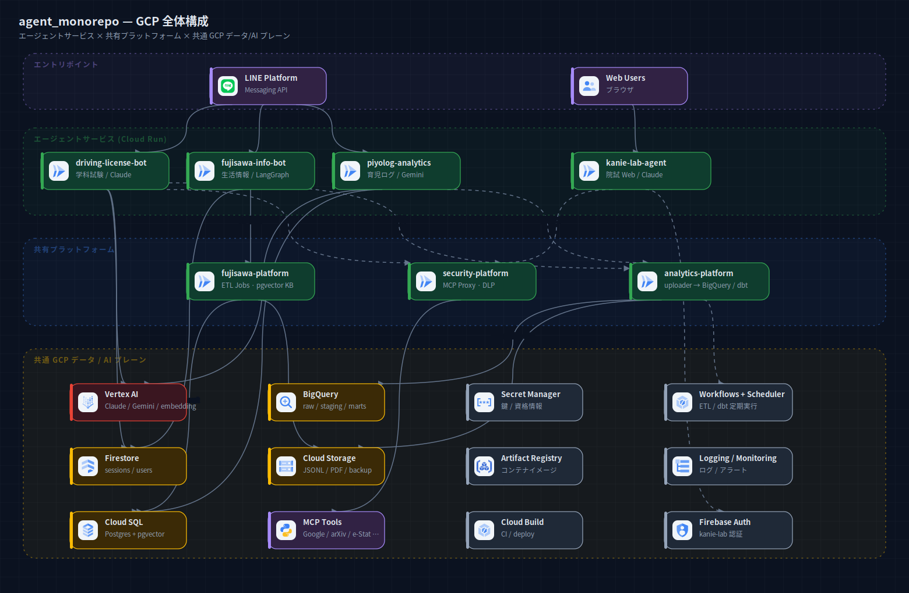

# agent_monorepo — GCP 全体構成図

モノレポ全体の GCP 構成を俯瞰する system-of-systems 図（タスク2）。
個々のシステム詳細は `docs/diagrams/systems/<name>/` を参照。



## 4 レイヤー構成

1. **エントリポイント** — LINE Platform（各 Bot）/ Web Users（kanie-lab）
2. **エージェントサービス (Cloud Run)** — driving-license-bot / fujisawa-info-bot /
   piyolog-analytics / kanie-lab-agent
3. **共有プラットフォーム** — fujisawa-platform（ETL・pgvector KB）/
   security-platform（MCP Proxy・DLP）/ analytics-platform（計装 → BigQuery / dbt）
4. **共通 GCP データ / AI プレーン** — Vertex AI / Firestore / Cloud SQL / BigQuery /
   Cloud Storage / MCP Tools / Secret Manager / Artifact Registry / Cloud Build /
   Workflows + Scheduler / Logging・Monitoring / Firebase Auth

## システム間連携（コードから確認）

| 連携 | 利用元 |
|---|---|
| **analytics-platform** へ計装 | driving-license-bot / piyolog-analytics / stock-analysis / lifeplanner / tech-news / hotcook |
| **security-platform** MCP Proxy 利用 | driving-license-bot / kanie-lab-agent / stock-analysis-agent |
| **fujisawa-platform** KB 参照 | fujisawa-info-bot（+ 保活エージェント） |
| **llm-client** 利用 | driving-license-bot / fujisawa-info-bot / lifeplanner / tech-news |

> 図は GCP デプロイ済みの主要サービスと代表的な連携に絞っている。全ノードの網羅ではなく、
> 俯瞰のための代表線を描いている（詳細は各システム図）。

出典: 各システムの `pyproject.toml` path dep / `config.py` / `docker-compose.yml` / `terraform`。

## 再生成

```bash
cd docs/diagrams
node build-system.mjs systems/_overview
python3 rasterize.py systems/_overview/gcp.svg
```
