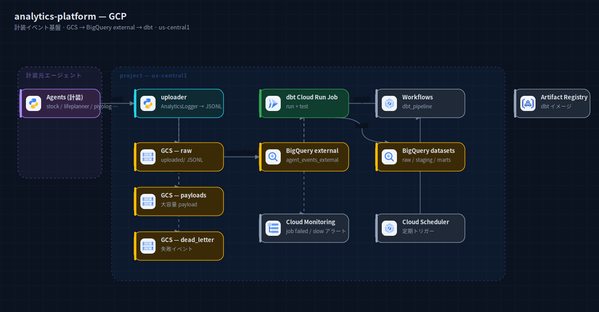
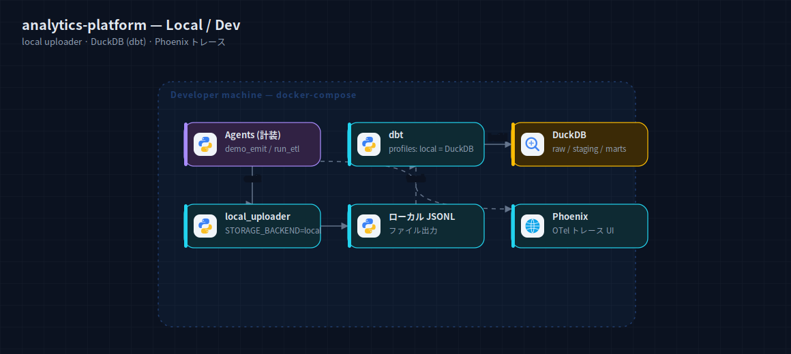

# analytics-platform — アーキテクチャ構成図

各エージェントの計装イベントを集約する観測基盤。GCS → BigQuery external table → dbt で
raw / staging / marts を構築する ELT パイプライン。

## GCP 本番



計装元エージェント（stock-analysis / lifeplanner / piyolog 等）が `uploader` でイベントを JSONL 化し、
GCS の raw / payloads / dead_letter バケットへ出力。BigQuery external table（`agent_events_external`）が
raw を直接読み、`dbt Cloud Run Job`（run + test）が raw / staging / marts データセットを構築。
Workflows（`dbt_pipeline`）+ Cloud Scheduler で定期実行し、Cloud Monitoring が job failed / slow を検知。
リージョンは us-central1。

出典: `analytics-platform/README.md` §4 + `workflows/dbt_pipeline.yaml` + `terraform/*.tf`（bigquery 3 dataset + external table, gcs 3 bucket, iam SAs, monitoring）。

## ローカル / 開発



`ANALYTICS_STORAGE_BACKEND=local` で `local_uploader` がローカル JSONL を出力、dbt は profiles の
local（DuckDB）で marts を構築。Phoenix（docker-compose）で OTel トレースを可視化。

出典: `analytics_platform/gcp_config.py`（backend 切替）+ `dbt/profiles.yml` + `docker-compose.yml`。

## 再生成

```bash
cd docs/diagrams
node build-system.mjs systems/analytics-platform
python3 rasterize.py systems/analytics-platform/local.svg systems/analytics-platform/gcp.svg
```
