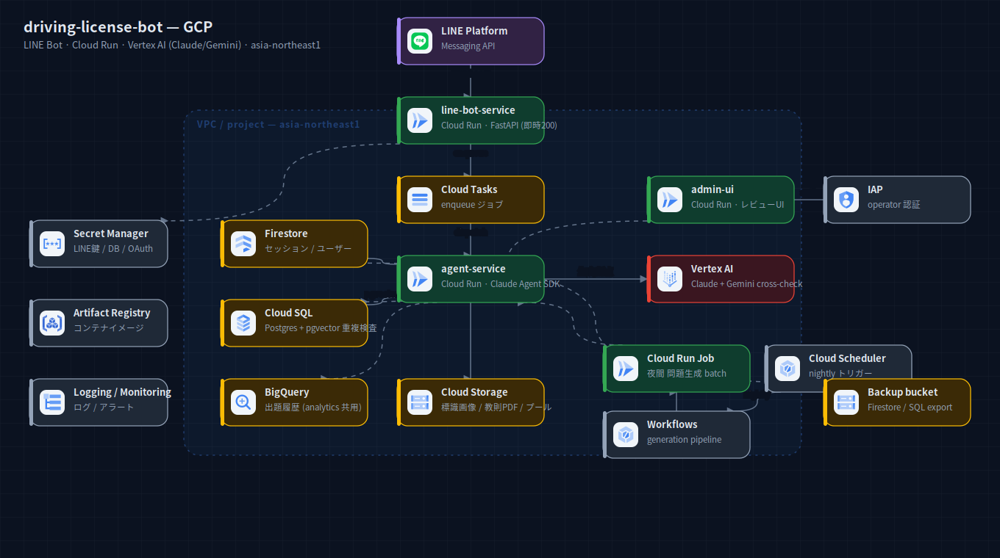
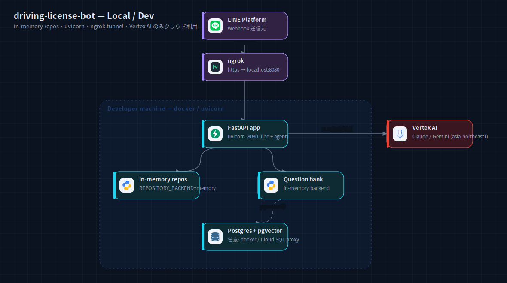

# driving-license-bot — アーキテクチャ構成図

学科試験対策 LINE Bot（問題を Vertex AI で自動生成）の構成図。ローカル開発版と GCP 本番版。

## GCP 本番



LINE Webhook → `line-bot-service`（Cloud Run / 即時200）→ Cloud Tasks → `agent-service`
（Cloud Run / Claude Agent SDK）。生成・採点は Vertex AI（Claude 本生成 + Gemini クロスチェック）。
永続化は Firestore（セッション）/ Cloud SQL（pgvector 重複検査）/ BigQuery（出題履歴・analytics 共用）/
Cloud Storage（標識画像・教則PDF・問題プール）。夜間バッチは Cloud Run Job を Workflows + Scheduler で駆動。
レビュー用 `admin-ui` は IAP で保護。Secret Manager / Artifact Registry / Logging が横断。

出典: `driving-license-bot/README.md` のアーキテクチャ概要 + `driving-license-bot/terraform/*.tf`。

## ローカル / 開発



単一 FastAPI プロセス（uvicorn :8080）を in-memory リポジトリで起動。LINE Webhook は ngrok 経由で
トンネル。クラウド依存は LLM（Vertex AI）のみ。pgvector を使う場合のみ Postgres（docker / Cloud SQL proxy）。

出典: `driving-license-bot/docs/SETUP.md` + `app/config.py`（`REPOSITORY_BACKEND=memory` 等）。

## 再生成

```bash
cd docs/diagrams
node build-system.mjs systems/driving-license-bot   # spec.*.mjs → *.svg + TSX
python3 rasterize.py systems/driving-license-bot/local.svg systems/driving-license-bot/gcp.svg
```

`spec.local.mjs` / `spec.gcp.mjs` を編集 → 上記で SVG / PNG / TSX を再生成。
React からは `DrivingLicenseBotDiagram` を `variant="local" | "gcp"` で利用。
