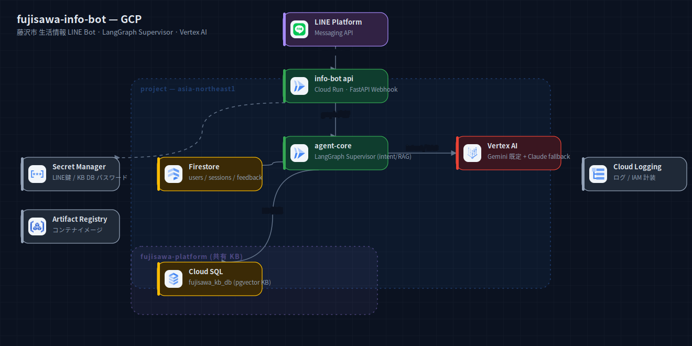
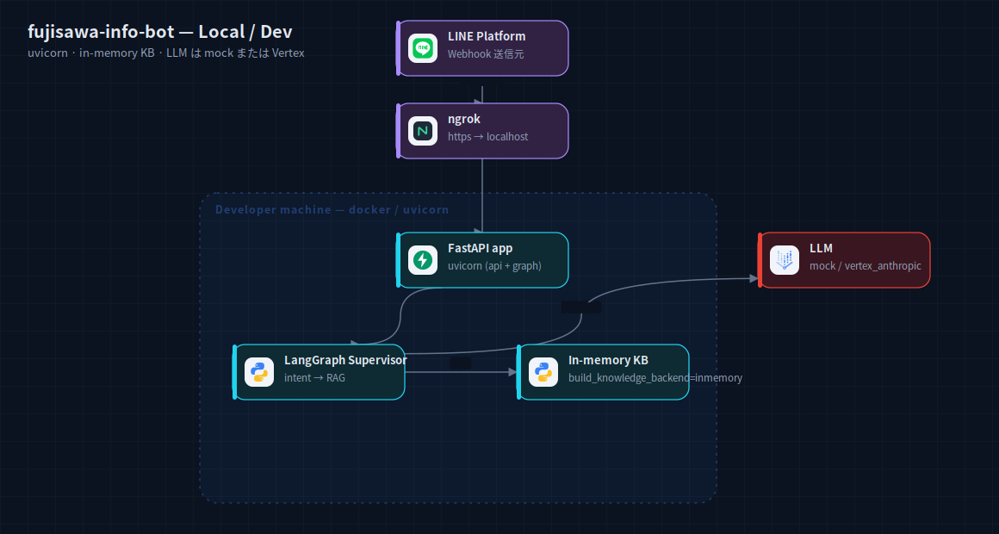

# fujisawa-info-bot — アーキテクチャ構成図

藤沢市の生活情報を案内する LINE Bot。LangGraph Supervisor で intent 分類 → RAG 回答。

## GCP 本番



2 サービス構成: `info-bot api`（Cloud Run / FastAPI Webhook 受け）と `agent-core`
（Cloud Run / LangGraph Supervisor）。LLM は Vertex AI Gemini 既定 + Claude フォールバック。
データは Firestore（users / sessions / feedback）と Cloud SQL（`fujisawa_kb_db` の pgvector KB、
`fujisawa-platform` 経由で共有）。Secret Manager / Artifact Registry / Logging が横断。

出典: `fujisawa-info-bot/README.md` §1 + `terraform/*.tf`（cloud_run, cloudsql, secrets, iam, artifact_registry）。

## ローカル / 開発



単一 FastAPI（uvicorn）で api + graph を起動。KB は in-memory（`build_knowledge_backend=inmemory`）、
LLM は mock または `vertex_anthropic`。Webhook は ngrok トンネル。

出典: `fujisawa-info-bot/README.md` §3 + `app/config.py`（factory 切替）。

## 再生成

```bash
cd docs/diagrams
node build-system.mjs systems/fujisawa-info-bot
python3 rasterize.py systems/fujisawa-info-bot/local.svg systems/fujisawa-info-bot/gcp.svg
```
