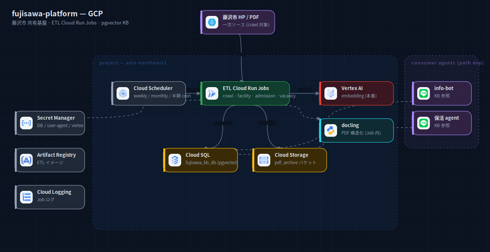
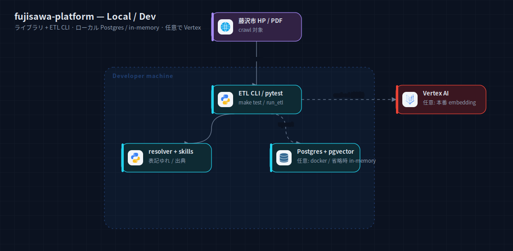

# fujisawa-platform — アーキテクチャ構成図

藤沢市 HP / PDF を一次ソースとする共有基盤（クロール / PDF解析 / ベクトル検索 / ETL）。
`fujisawa-info-bot` / 保活エージェントが path dep で KB を参照する。

## GCP 本番



LINE エントリポイントは持たず、**ETL Cloud Run Jobs**（weekly_crawl / half_yearly_facility /
biyearly_admission 1st·2nd / monthly_vacancy）を Cloud Scheduler の cron で駆動。Job は藤沢市 HP を
クロールし、docling で PDF を構造化、Vertex AI で embedding し、Cloud SQL（`fujisawa_kb_db` pgvector）に
upsert・Cloud Storage（pdf_archive）に保存。consumer エージェントは Cloud SQL の KB を参照。

出典: `fujisawa-platform/README.md` + `terraform/*.tf`（cloud_run_jobs ETL for_each, scheduler, cloudsql, gcs, secrets, iam）。

## ローカル / 開発



ライブラリ + ETL CLI として `make test` / `run_etl` で実行。KB はローカル Postgres（pgvector）または
省略時 in-memory。embedding は任意で Vertex。

出典: `fujisawa-platform/README.md` §0（make install-* extras, optional Cloud SQL + pgvector）。

## 再生成

```bash
cd docs/diagrams
node build-system.mjs systems/fujisawa-platform
python3 rasterize.py systems/fujisawa-platform/local.svg systems/fujisawa-platform/gcp.svg
```
