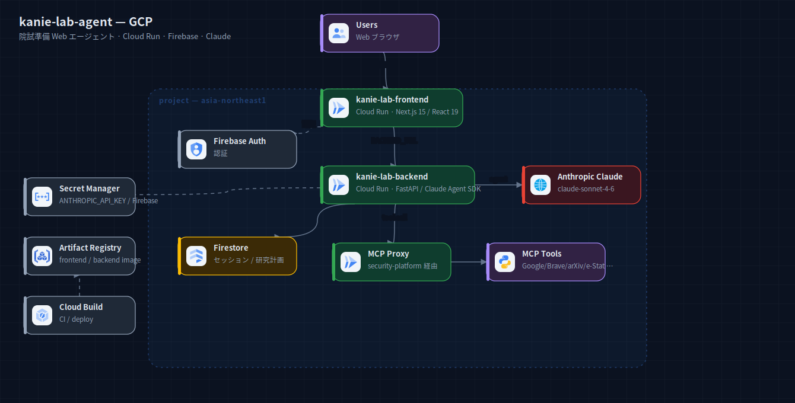
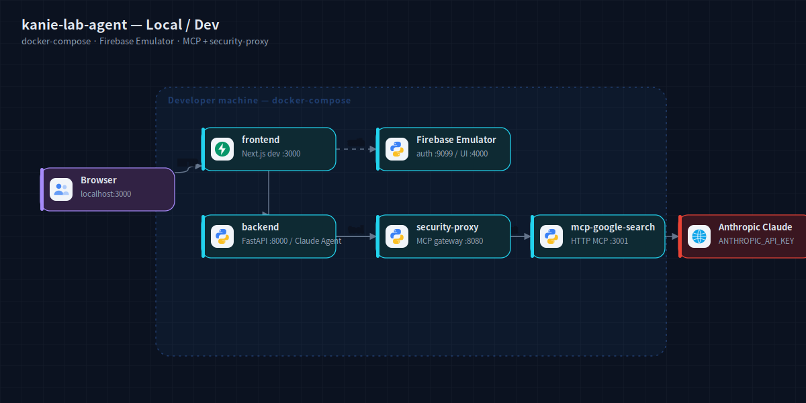

# kanie-lab-agent — アーキテクチャ構成図

慶應SFC 蟹江研究室の大学院入試準備を支援する AI リサーチ Web アプリ。

## GCP 本番



`kanie-lab-frontend`（Cloud Run / Next.js 15・React 19）と `kanie-lab-backend`
（Cloud Run / FastAPI・Claude Agent SDK）の 2 サービス。認証は Firebase Auth、データは Firestore。
LLM は Anthropic Claude（claude-sonnet-4-6）。MCP ツール（Google / Brave / arXiv / e-Stat 等）は
security-platform の MCP Proxy 経由で呼ぶ。Secret Manager / Artifact Registry / Cloud Build が横断。

出典: `kanie-lab-agent/README.md`（技術スタック）+ `infra/cloudrun/{frontend,backend}.yaml` +
`infra/scripts/setup-gcp.sh`（firestore / secrets / artifacts / SA）+ `docker-compose.yml`。

## ローカル / 開発



docker-compose で frontend（:3000）/ backend（:8000）/ Firebase Emulator（auth :9099, UI :4000）/
security-proxy（MCP gateway :8080）/ mcp-google-search（:3001）を起動。LLM は Anthropic API。

出典: `kanie-lab-agent/docker-compose.yml` + README ローカルセットアップ。

## 再生成

```bash
cd docs/diagrams
node build-system.mjs systems/kanie-lab-agent
python3 rasterize.py systems/kanie-lab-agent/local.svg systems/kanie-lab-agent/gcp.svg
```
