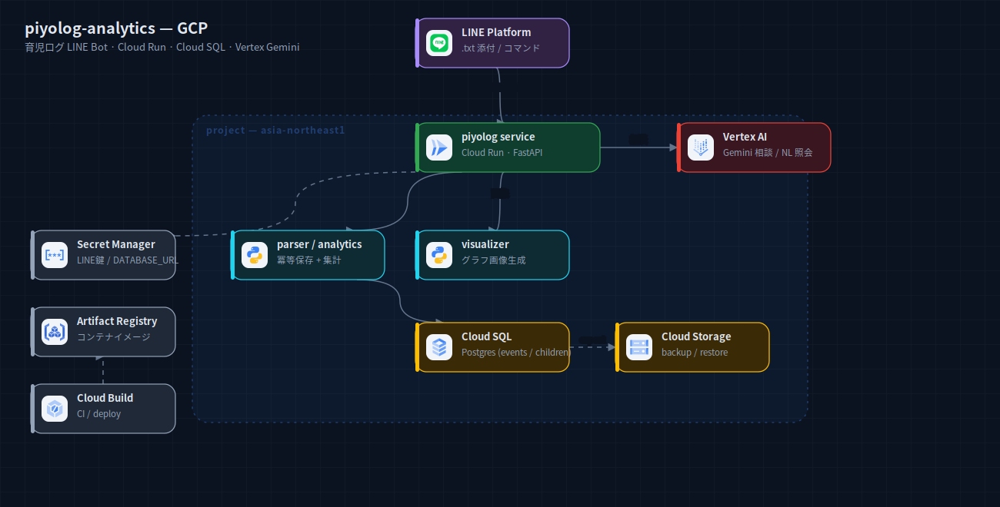
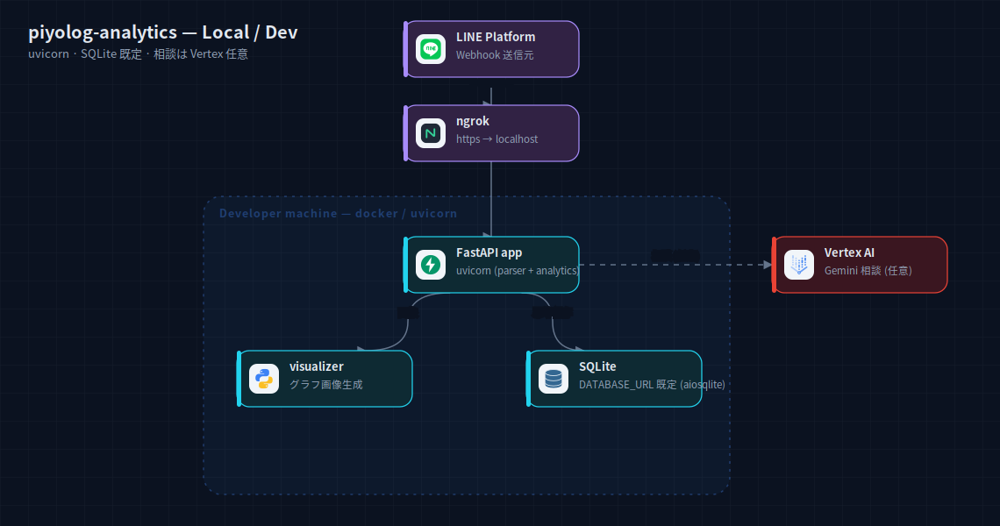

# piyolog-analytics — アーキテクチャ構成図

ぴよログ（育児ログ）の `.txt` を解析し、期間サマリ・グラフ・相談を提供する LINE Bot。

## GCP 本番



`piyolog service`（Cloud Run / FastAPI、cloudbuild 経由で配備）が LINE Webhook を受け、parser で
`.txt` を冪等保存・analytics で集計、visualizer でグラフ画像を生成、Vertex AI Gemini で相談・自然言語照会。
永続化は Cloud SQL（events / children）、Cloud Storage に backup/restore。
Secret Manager / Artifact Registry / Cloud Build が横断。

出典: `piyolog-analytics/README.md` + `terraform/*.tf`（cloud_sql, backup_bucket, secrets, iam, artifact_registry）+ `app/services/*`。

## ローカル / 開発



単一 FastAPI（uvicorn）。DB は既定で SQLite（`DATABASE_URL` 既定 `sqlite+aiosqlite`）。相談は任意で Vertex。
Webhook は ngrok トンネル。

出典: `app/config.py`（`DATABASE_URL` 解決ロジック）+ README。

## 再生成

```bash
cd docs/diagrams
node build-system.mjs systems/piyolog-analytics
python3 rasterize.py systems/piyolog-analytics/local.svg systems/piyolog-analytics/gcp.svg
```
